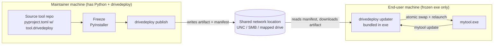

# drivedeploy — Phase 0: Overview & Roadmap

> **Status:** All decisions resolved (2026-06-29). Cleared to execute Phase 1.
> **Author:** Sterling Collins (decisions) + assistant (draft)
> **Purpose:** Sketch the concept, architecture, and a phased path from MVP to a
> publishable solution. All strategic decisions are baked into the relevant sections
> and recorded in §13.1; §13.2 confirms nothing strategic remains open.

---

## 1. Problem Statement

Teams that work in **restricted / air-gapped network environments** often cannot
use the normal software distribution channels:

- No internal PyPI mirror, Artifactory, or other on-prem package manager.
- No internet access to pull from public PyPI / GitHub Releases.
- No permission to stand up servers (no HTTP service, no S3, no registry).

What these environments *do* usually have is a **shared network location** — a
mapped network drive or UNC/SMB path that appears as a normal filesystem path on
each machine. (Synced cloud folders are a possible future target — see D13.)

`drivedeploy` turns that humble shared folder into a lightweight, server-less
**distribution channel for frozen Python tools**, with two halves:

1. **Publish side** (maintainer): take a frozen executable (PyInstaller first; other
  freezers via a pluggable interface) and push it to the shared location with
   versioned metadata.
2. **Pull side** (end user, embedded in the tool): a built-in command that checks
  the shared location and self-updates the running tool, making upgrades painless.

The shared location and channel settings live in the **consuming tool's**
`pyproject.toml` (under a `[tool.drivedeploy]` table) — *not* in this library — so
each tool tracks its own deployment target alongside its own metadata.

---


## 2. Constraints & Assumptions


| #   | Constraint / Assumption                                                                                                        | Notes                                                                                                                       |
| --- | ------------------------------------------------------------------------------------------------------------------------------ | --------------------------------------------------------------------------------------------------------------------------- |
| C1  | Distribution medium is a **filesystem path** (UNC / SMB / mapped drive).                                                       | No HTTP, no auth server. No auth at all (D9).                                                                               |
| C2  | End users run a **frozen executable**; they may not have Python installed.                                                     | Client/update logic must be bundled into the exe.                                                                           |
| C3  | Maintainers building/publishing tools **have a normal dev environment** with `uv`/`pip` and internet to install `drivedeploy`. | So `drivedeploy` is a normal PyPI/uv dependency (D15).                                                                      |
| C4  | The shared location is **trusted** for the MVP (only maintainers can write).                                                   | Checksums guard against corruption, not malice (D1). Code-signing is the maintainer's responsibility at the artifact level. |
| C5  | Per-tool config lives in the **tool's** `pyproject.toml`.                                                                      | `drivedeploy` reads it; it is not config for this library.                                                                  |
| C6  | MVP is **Windows-only by behavior**, but the code includes OS guards that raise `NotImplementedError` on other OSes (D2).      | Cross-platform self-replace is Phase 3.                                                                                     |


---


## 3. Core Concepts & Terminology

- **Tool**: the end-user application being distributed (a frozen exe). Identified by
a name (the tool's own package name by default). The clean, primary case is
**one tool per repo**; multi-tool repos are supported as an enhancement (D4).
- **Channel**: an optional release track within the shared location (e.g. `stable`,
`beta`). Authors who don't care about channels leave it blank and publish to a
single **default channel** (D5).
- **Artifact**: a single distributable — either a one-file exe or an archived
one-dir bundle (D8).
- **Drive / Network location**: the root shared path that hosts one or more tools.
- **Manifest / Index**: a human-readable **JSON** file (D3) at the network location
describing tools, versions, filenames, checksums, etc. (§6).
- **Publisher**: maintainer-side workflow that writes artifacts + manifest entries.
- **Updater / Client**: tool-side workflow that reads the manifest and self-updates.

---


## 4. High-Level Architecture




Two libraries-in-one, sharing a common core (manifest model, path resolution,
checksums, versioning):

- `drivedeploy.publish.*` — used at build/release time by maintainers.
- `drivedeploy.update.*` — bundled into the frozen tool for self-update.
- `drivedeploy.core.*` — shared manifest schema, config loading, hashing, layout,
versioning, platform tags, freezer abstraction.

The public surface is a **functional API** (D11). A ready-made CLI is opt-in via an
extra (`drivedeploy[typer]`).

---


## 5. The Two Workflows


### 5.1 Publish (maintainer)

1. Maintainer freezes the tool into an executable (one-file or one-dir).
2. Runs `drivedeploy publish` (or calls the API from a release script).
3. `drivedeploy` reads `[tool.drivedeploy]` from the tool's `pyproject.toml` to learn:
  the network location, tool name, channel, platform, artifact path, version source.
4. It (archives the bundle if one-dir, then) copies the artifact to the correct spot
  on the drive and updates the manifest (version, checksum, size, timestamp, filename).


### 5.2 Update (end user, via the tool)

1. Tool exposes an update entry point (the author wires the functional API into
  their own command, e.g. `mytool update` / `mytool update --check`).
2. The bundled updater resolves its baked-in config (D7), reads the manifest, and
  compares the running version against the latest available in its channel.
3. If newer: downloads the artifact to a temp location, verifies the checksum,
  performs an atomic swap, and relaunches (§7).
4. **Rollback** is "update to an older version": the client downloads a specific,
  still-archived older version from the remote (we do **not** keep local copies) (D6).

---


## 6. Network Layout & Manifest

Confirmed: **JSON**, human-readable (D3). One location can host **many tools**, but
the **one-tool-per-repo** path must be clean and robust (D4).

```
\\share\tools\drivedeploy\
├── index.json                      # top-level registry of tools (multi-tool case)
└── mytool\
    ├── manifest.json               # per-tool manifest (versions, channels)
    ├── stable\
    │   ├── mytool-1.3.0-win64.exe
    │   ├── mytool-1.4.0-win64.exe        # one-file artifact
    │   └── mytool-1.4.0-win64.zip        # one-dir artifact (archived)
    └── beta\
        └── mytool-1.5.0b1-win64.exe
```

When no channel is configured, artifacts land in a single default channel
directory (proposed name: `release`) so the "I don't use channels" path stays
simple (D5).

Per-tool `manifest.json` (draft schema, `schema_version: 1`):

```json
{
  "schema_version": 1,
  "tool": "mytool",
  "channels": {
    "stable": {
      "latest": "1.4.0",
      "releases": [
        {
          "version": "1.4.0",
          "platform": "win64",
          "kind": "onefile",
          "filename": "stable/mytool-1.4.0-win64.exe",
          "sha256": "<hash>",
          "size": 12345678,
          "published_at": "2026-06-29T21:00:00Z",
          "notes": "Optional release notes / changelog pointer"
        }
      ]
    }
  }
}
```

Notes:

- `kind` distinguishes `onefile` vs `onedir` so the client knows whether to extract.
- `latest` is a convenience pointer; the client still compares versions to be safe.
- Manifest writes use write-temp-then-`os.replace` for atomicity. (Full concurrent
publish locking is Phase 2.)

---


## 7. Self-Update Mechanics (the hard part)

MVP is **Windows-only**; the updater raises `NotImplementedError` on other OSes (D2).

1. Download the new artifact to a local temp dir (never run from the share).
2. Verify the SHA256 against the manifest.
3. Swap, by artifact kind (D8):
  - **one-file (**`.exe`**):** rename the running exe → `*.old`, move the new exe into
   place, relaunch, and delete `*.old` on the next start (a running exe can't be
   deleted). Alternatively spawn a tiny helper that waits for exit, swaps, relaunches.
  - **one-dir (folder, shipped as** `.zip`**):** the running exe inside the dir is
  locked, so use the **helper-process approach**: extract to a temp sibling dir,
  spawn a helper, exit, let the helper swap the directories and relaunch.
4. **Rollback** = request an older version explicitly (e.g. `--version 1.3.0`); the
  client re-downloads that archived version from the remote (D6). No local history.

The helper/relaunch path is the riskiest engineering piece and needs careful testing.

**AV-safe fallback (D19).** Live in-place swaps — especially the helper-process
directory swap for one-dir builds — can trip antivirus / SmartScreen heuristics. The
swap layer is therefore designed with a **pluggable strategy and a fallback mode**:
when a live swap fails or is disabled, `drivedeploy` instead **stages** the verified
new version alongside the install and either (a) applies it on the next launch via a
pending-update marker the tool checks at startup, or (b) emits clear manual
instructions / a small generated script. The live-swap path must be validated on a
real Windows box with AV enabled; the staged fallback is the safety net.

---


## 8. Integrity & Security

For the MVP the share is **trusted** (D1): only maintainers can write, so checksums
exist to catch **corruption / partial copies**, not tampering.

- **Checksums (SHA256)** are recorded in the manifest and verified on download.
- **Artifact-level signing is out of** `drivedeploy`**'s scope** — code signing of the
exe is the maintainer's responsibility, done on the artifact before publish (D1).
`drivedeploy` does **not** sign the manifest or distribution.
- **No authentication** to the share; we rely on OS mount/ACLs (D9).

Distribution-level signing (signing the manifest, bundling a public key in the
client) is deferred to a later phase if the trust model ever changes.

---


## 9. Configuration in the Tool's `pyproject.toml`

```toml
[tool.drivedeploy]
name = "mytool"                                  # tool identity in the manifest (default: [project].name)
location = "\\\\share\\tools\\drivedeploy"        # network root (UNC / SMB / mapped drive)
channel = "stable"                                # optional; omit/blank -> default "release" channel
platform = "win64"                                # optional; derived from the build host if omitted
artifact = "dist/mytool.exe"                      # path to frozen output (file for onefile, dir for onedir)
kind = "onefile"                                  # "onefile" | "onedir"
version_source = "project"                        # "project" (default) | "vcs" | "<explicit literal>"
```

**Version source of truth (D10):** default to `[project].version`. If that is
declared `dynamic`, fall back to VCS tags (`git describe --tags`). The author may
override via `version_source` (e.g. pin a literal, or force `vcs`).

**Client-side config (D7) — still open, see §13.2.** The frozen exe has no source
tree at runtime, so the client config must be embedded at build time. The two
candidates (bake-in data file vs generated module) are analyzed in §13.2; Phase 1
will adopt a tentative default pending your confirmation.

---


## 10. CLI / API Surface

Public surface is a **functional API first** (D11), e.g.:

```python
from drivedeploy import publish, update

publish.publish(project_dir=".")     # maintainer side
update.check()                       # is there a newer version?
update.apply()                       # download, verify, swap, relaunch
```

A ready-made CLI is **opt-in via an extra**: installing `drivedeploy[typer]` exposes
a thin Typer app so a tool author can mount a `mytool update` subcommand without
wiring it themselves. Without the extra, `drivedeploy` stays dependency-light and
purely functional.

Planned maintainer commands (Typer extra): `init`, `publish`, `list`, `verify`.

---


## 11. Phased Roadmap


### Phase 0 — Overview (this document) ✅

Concepts agreed, decisions captured.

### Phase 1 — MVP (Windows-only, trusted share, happy path)

Goal: prove the publish → update round-trip on a real network drive. See
`Phase1_MVP.md` for the detailed plan.

- Core: config loader, JSON manifest model, SHA256 hashing, path/layout resolution,
version resolution, platform tag, freezer interface (PyInstaller impl).
- `publish.publish()`: archive (one-dir) + copy artifact + write/update manifest.
- Client `update.check()` / `update.apply()` for **Windows** (one-file + one-dir),
OS guards raising `NotImplementedError` elsewhere.
- Channels supported, with a single default channel when unspecified.
- Checksums only (no distribution signing).
- Rollback by explicit version re-download from remote.
- Add a `change-log.md` (repo convention).
- Tests in `tests/` over a temp-dir-backed "fake drive".


### Phase 2 — Robustness

- Channel UX polish and SemVer comparison hardening.
- `--check` UX, "update available" notifications, prompts vs auto-apply.
- Manifest locking / safe concurrent publish.
- Retention/pruning policy for old archived versions (balancing rollback vs space).
- `index.json` multi-tool registry maturity.


### Phase 3 — Cross-platform & hardening

- macOS/Linux self-replace (remove the `NotImplementedError` guards).
- Additional freezer backends (Nuitka/cx_Freeze) via the interface from Phase 1 (D14).
- Optional distribution-level signing + public-key verification (if trust model changes).


### Phase 4 — Publishable / polish

- Docs (mkdocs), examples, quickstart.
- `drivedeploy init` scaffolding, `drivedeploy verify`.
- Synced cloud folder support if warranted (D13).
- Packaging for PyPI, CI, type hints, full test coverage, README + usage guide.

---


## 12. Risks & Open Concerns

- **Self-overwrite on Windows** (esp. one-dir directory swaps) is the trickiest
engineering problem; the helper/relaunch approach needs careful testing.
- **Antivirus / SmartScreen** may flag freshly-swapped unsigned exes (mitigated by
the maintainer doing artifact-level code signing, D1).
- **Concurrent publishes** could corrupt the manifest without locking (Phase 2);
the temp-then-replace write reduces but does not eliminate the window.
- **Dynamic version detection** (D10) depends on git being available at build time
when `version_source = "vcs"`.
- **Client config embedding** (D7) couples us to the freezer's data-bundling unless
we pick the freezer-agnostic generated-module approach.

---


## 13. Decisions


### 13.1 Resolved (from review on 2026-06-29)


| ID  | Decision                       | Resolution                                                                                                         |
| --- | ------------------------------ | ------------------------------------------------------------------------------------------------------------------ |
| D1  | Trust model                    | **Trusted** shares for MVP; checksums only. Signing is artifact-level (maintainer's job), not done by drivedeploy. |
| D2  | Platforms                      | **Windows-only** MVP; include OS guards that raise `NotImplementedError` elsewhere.                                |
| D3  | Manifest format                | **JSON** (human-readable).                                                                                         |
| D4  | Layout                         | **One tool per repo** is the clean primary case; multi-tool repos stay in scope as an enhancement.                 |
| D5  | Channels                       | **Supported**, but optional — blank ⇒ single default channel.                                                      |
| D6  | Rollback                       | Re-download **older archived versions from the remote**; no local history.                                         |
| D7  | Client config source           | **Bake-in or generated module** — analyze pros/cons (see §13.2, still open).                                       |
| D8  | Artifact form                  | **Both** one-file and one-dir (one-dir archived to `.zip`).                                                        |
| D9  | Auth                           | **No auth**; rely on OS mount/ACLs.                                                                                |
| D10 | Version source                 | Prefer `[project].version`; if dynamic, use **VCS tags**; allow `version_source` override in `[tool.drivedeploy]`. |
| D11 | Client integration             | **Functional API first**; ready-made CLI via optional `drivedeploy[typer]` extra.                                  |
| D12 | MVP scope                      | **Confirmed** as written.                                                                                          |
| D13 | Location types                 | **UNC / SMB / mapped drives** are priority; synced cloud folders are nice-to-have (Phase 4).                       |
| D14 | Freezers                       | **PyInstaller** first; design a freezer interface to allow other backends later.                                   |
| D15 | Offline install of drivedeploy | Not required — **maintainers have internet**.                                                                      |
| D7a | Client config embedding        | **(B) Generated module** — `drivedeploy embed` writes a `_drivedeploy_embed.py` with config as constants; freezer-agnostic. |
| D16 | Default channel name           | **`release`** when `channel` is blank.                                                                             |
| D17 | One-dir archive format         | **`.zip`** (stdlib `zipfile`).                                                                                     |
| D18 | Platform tag (MVP)             | **`win64`**.                                                                                                       |
| D19 | One-dir update flow            | **Extract + helper-swap dir**, *plus* an **AV-safe staged fallback** (§7); must be tested on Windows with AV on.   |


### 13.2 Remaining Open Decisions

All Phase 0 decisions are resolved. The only follow-up is empirical, not strategic:
validate the live one-dir directory swap on a real Windows machine with antivirus
enabled, and exercise the staged fallback (D19, §7) — tracked as a Phase 1 task, not
a blocking decision.


| ID  | Decision                                      | Options / Analysis                                                                                                                                                                                                                                                                                                                                                                                                                                                                                                                                                                                                                                                                                                                                                                                               | Your answer                                                                                                        |
| --- | --------------------------------------------- | ---------------------------------------------------------------------------------------------------------------------------------------------------------------------------------------------------------------------------------------------------------------------------------------------------------------------------------------------------------------------------------------------------------------------------------------------------------------------------------------------------------------------------------------------------------------------------------------------------------------------------------------------------------------------------------------------------------------------------------------------------------------------------------------------------------------- | ------------------------------------------------------------------------------------------------------------------ |
| D7a | **Client config embedding mechanism**         | **(A) Bake-in data file** — `drivedeploy` writes a small `drivedeploy.json` that the maintainer bundles via PyInstaller `--add-data`; client reads it from `sys._MEIPASS` at runtime. *Pros:* config is pure data, easy to change without code edits. *Cons:* PyInstaller-specific lookup, differs one-file vs one-dir, fights the freezer-agnostic goal (D14). **(B) Generated module** — `drivedeploy embed` generates e.g. `mytool/_drivedeploy_embed.py` with config as constants; it freezes like any other module. *Pros:* freezer-agnostic, no runtime file lookup, importable/testable, identical one-file vs one-dir. *Cons:* generated source must be regenerated on config change (build step) and committed or gitignored. **Recommendation: (B)**, as it aligns with D14 and is simpler at runtime. | B                                                                                                                  |
| D16 | **Default channel name**                      | When `channel` is blank, what directory/label do we use? Proposed: `release`. Alternatives: `stable`, `default`.                                                                                                                                                                                                                                                                                                                                                                                                                                                                                                                                                                                                                                                                                                 | release                                                                                                            |
| D17 | **One-dir archive format**                    | Proposed: `.zip` (stdlib `zipfile`, native on Windows). Alternative: `.tar.gz`.                                                                                                                                                                                                                                                                                                                                                                                                                                                                                                                                                                                                                                                                                                                                  | zip                                                                                                                |
| D18 | **Platform tag scheme**                       | How to name/derive `platform`? Proposed: simple `win64` for MVP, derived from arch; later use `{os}-{arch}` (e.g. `win-amd64`). Confirm the MVP label.                                                                                                                                                                                                                                                                                                                                                                                                                                                                                                                                                                                                                                                           | win64                                                                                                              |
| D19 | **Artifact filename when on-dir is archived** | A one-dir build produces a folder; on the drive it's `mytool-<ver>-<plat>.zip`. Confirm the client should extract next to the current install dir, then helper-swap the directory.                                                                                                                                                                                                                                                                                                                                                                                                                                                                                                                                                                                                                               | Confirm, but we'll need to test this. A fallback option should be provided incase AV gets triggered by live swaps. |


---


## 14. Out of Scope (for now)

- Hosting an actual HTTP/registry server (defeats the purpose).
- Dependency resolution / installing arbitrary Python packages (we ship frozen exes,
not wheels). Revisit only if we later want to distribute wheels too.
- Distribution-level signing (deferred; artifact-level signing is the maintainer's job).
- GUI updater (functional API / CLI first).
- Authentication to the share.

