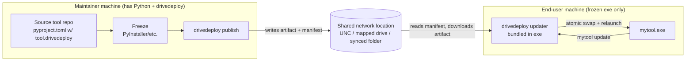

# drivedeploy — Phase 0: Overview & Roadmap

> **Status:** Draft for review
> **Author:** (drafted by assistant, pending Sterling's input)
> **Purpose:** Sketch the concept, architecture, and a phased path from MVP to a
> publishable solution. Sections marked **❓DECISION** or `<<FILL IN>>` need
> Sterling's strategic input before we commit to an implementation.

---

## 1. Problem Statement

Teams that work in **restricted / air-gapped network environments** often cannot
use the normal software distribution channels:

- No internal PyPI mirror, Artifactory, or other on-prem package manager.
- No internet access to pull from public PyPI / GitHub Releases.
- No permission to stand up servers (no HTTP service, no S3, no registry).

What these environments *do* usually have is a **shared network location** — a
mapped network drive, UNC path, or a synced cloud folder (OneDrive / SharePoint /
Google Drive) that appears as a normal filesystem path on each machine.

`drivedeploy` turns that humble shared folder into a lightweight, server-less
**distribution channel for frozen Python tools**, with two halves:

1. **Publish side** (maintainer): take a frozen executable (PyInstaller / Nuitka /
   etc.) and push it to the shared location with versioned metadata.
2. **Pull side** (end user, embedded in the tool): a built-in command that checks
   the shared location and self-updates the running tool, making upgrades painless.

The shared location and channel settings live in the **consuming tool's**
`pyproject.toml` (under a `[tool.drivedeploy]` table) — *not* in this library — so
each tool tracks its own deployment target alongside its own metadata.

---

## 2. Constraints & Assumptions

| # | Constraint / Assumption | Notes |
|---|--------------------------|-------|
| C1 | Distribution medium is a **filesystem path** (network drive / UNC / synced folder). | No HTTP, no auth server. |
| C2 | End users run a **frozen executable**; they may not have Python installed. | Client/update logic must be bundled into the exe. |
| C3 | Maintainers building/publishing tools **do** have a normal dev environment with `uv`/`pip` (and likely internet) to install `drivedeploy`. | So `drivedeploy` itself can be a normal PyPI/uv dependency. |
| C4 | The shared location may be **writable by multiple people** — trust level varies. | Drives integrity & security decisions (§8). |
| C5 | Per-tool config lives in the **tool's** `pyproject.toml`. | `drivedeploy` reads it; it is not config for this library. |
| C6 | Primary dev OS is **Windows**, but tools may target multiple OSes. | Self-replace mechanics differ per OS (§7). ❓DECISION D2. |

---

## 3. Core Concepts & Terminology

- **Tool**: the end-user application being distributed (a frozen exe). Identified by
  a name (likely the tool's own package name).
- **Channel**: a release track within the shared location (e.g. `stable`, `beta`).
  ❓DECISION D5.
- **Artifact**: a single distributable file/bundle (e.g. `mytool-1.4.0-win64.exe`).
- **Drive / Network location**: the root shared path that hosts one or more tools.
- **Manifest / Index**: a machine-readable file at the network location describing
  available tools, versions, filenames, checksums, etc. (§6).
- **Publisher**: maintainer-side workflow that writes artifacts + manifest entries.
- **Updater / Client**: tool-side workflow that reads the manifest and self-updates.

---

## 4. High-Level Architecture



Two libraries-in-one, sharing a common core (manifest model, path resolution,
checksums):

- `drivedeploy.publish.*` — used at build/release time by maintainers.
- `drivedeploy.update.*` — bundled into the frozen tool for self-update.
- `drivedeploy.core.*` — shared manifest schema, config loading, hashing, layout.

---

## 5. The Two Workflows

### 5.1 Publish (maintainer)

1. Maintainer freezes the tool into an executable.
2. Runs `drivedeploy publish` (or calls the API from a release script).
3. `drivedeploy` reads `[tool.drivedeploy]` from the tool's `pyproject.toml` to learn:
   the network location, tool name, channel, version, artifact path/glob.
4. It copies the artifact to the correct spot on the drive and updates the manifest
   (version, checksum, timestamp, filename).

### 5.2 Update (end user, via the tool)

1. Tool exposes a subcommand (e.g. `mytool update` / `mytool update --check`).
2. The bundled updater resolves the network location (baked in at build time — see
   ❓DECISION D7 on where the client gets its config), reads the manifest, compares
   the running version against the latest available in its channel.
3. If newer: downloads the artifact to a temp location, verifies the checksum,
   performs an atomic swap, and relaunches (§7).

---

## 6. Proposed Network Layout & Manifest (DRAFT — needs sign-off)

A possible on-drive structure (one location hosting potentially many tools):

```
\\share\tools\drivedeploy\
├── index.json                      # top-level registry of tools (optional)
└── mytool\
    ├── manifest.json               # per-tool manifest (versions, channels)
    ├── stable\
    │   ├── mytool-1.3.0-win64.exe
    │   └── mytool-1.4.0-win64.exe
    └── beta\
        └── mytool-1.5.0b1-win64.exe
```

Draft per-tool `manifest.json`:

```json
{
  "schema_version": 1,
  "tool": "mytool",
  "channels": {
    "stable": {
      "latest": "1.4.0",
      "releases": [
        {
          "version": "1.4.0",
          "platform": "win64",
          "filename": "stable/mytool-1.4.0-win64.exe",
          "sha256": "<hash>",
          "size": 12345678,
          "published_at": "2026-06-29T21:00:00Z",
          "min_update_from": null,
          "notes": "Optional release notes / changelog pointer"
        }
      ]
    }
  }
}
```

**❓DECISION D3 — Manifest format:** JSON (proposed, ubiquitous, no deps) vs TOML
(consistent with `pyproject.toml`) vs other. `<<FILL IN>>`

**❓DECISION D4 — Layout:** one shared registry hosting many tools, vs one isolated
location per tool? `<<FILL IN>>`

---

## 7. Self-Update Mechanics (the hard part)

A running executable typically **cannot overwrite itself in place** — especially on
Windows, where the running binary is locked. Proposed approach:

1. Download new artifact to a temp dir on the local machine (not run from the share).
2. Verify checksum (and signature if enabled, §8).
3. Swap strategy (per OS):
   - **Windows:** rename the running exe → `mytool.old`, move new exe into place,
     relaunch, then delete `mytool.old` on next start (can't delete a running file).
     Alternatively spawn a tiny helper/batch that waits for exit, swaps, relaunches.
   - **macOS/Linux:** can usually `os.replace()` the file while running; relaunch.
4. **Rollback:** keep the previous version so a failed update can be reverted.
   ❓DECISION D6.

**❓DECISION D2 — Target platforms for MVP:** Windows only first, or cross-platform
from the start? `<<FILL IN>>` (Strongly shapes this section.)

**❓DECISION D8 — Onefile vs onedir:** Are we distributing single-file exes
(`--onefile`), or one-dir bundles (a folder)? Folder swaps are more involved.
`<<FILL IN>>`

---

## 8. Integrity & Security

Because the share may be writable by many people (C4), an artifact could be tampered
with. Layers we *could* apply:

- **Checksums (SHA256)** recorded in the manifest — detects corruption, not malice
  (an attacker who can edit the artifact can edit the manifest too).
- **Signing** — sign the manifest and/or artifacts with a private key; bundle the
  **public key** into the frozen tool so the client can verify authenticity even on
  an untrusted share. Candidate tools: `minisign`, `cryptography` (Ed25519), GPG.
- **Filesystem ACLs** — rely on the share permissions so only maintainers can write.

**❓DECISION D1 — Trust model:** Is the share trusted (only maintainers can write, so
checksums-for-corruption are enough), or untrusted (we need signing)? `<<FILL IN>>`

**❓DECISION D9 — Authentication:** Any auth needed to reach the share, or do we rely
entirely on OS-level mounting/ACLs? `<<FILL IN>>`

---

## 9. Configuration in the Tool's `pyproject.toml` (DRAFT)

```toml
[tool.drivedeploy]
name = "mytool"                                  # tool identity in the manifest
location = "\\\\share\\tools\\drivedeploy"        # network root (UNC / drive / path)
channel = "stable"                                # default publish/update channel
platform = "win64"                                # ❓ how do we name/derive this?
artifact = "dist/mytool.exe"                      # path/glob to the frozen output
# version is read from [project].version by default? ❓DECISION D10
```

**❓DECISION D7 — Client-side config source:** The frozen exe won't have the source
`pyproject.toml` at runtime. Options: (a) bake the relevant config into the exe at
build time, (b) ship a small sidecar config file, (c) embed via a generated module.
`<<FILL IN>>`

**❓DECISION D10 — Version source of truth:** Read from `[project].version`, a VCS
tag, or an explicit `drivedeploy` field? `<<FILL IN>>`

---

## 10. Proposed CLI / API Surface (DRAFT)

Maintainer CLI:

- `drivedeploy init` — scaffold the `[tool.drivedeploy]` table interactively.
- `drivedeploy publish [--channel ...] [--version ...]` — push artifact + update manifest.
- `drivedeploy list [tool]` — show what's available on the drive.
- `drivedeploy verify` — validate manifest/checksums on the drive.

Client (embedded in the tool) — exposed as a library API the tool author mounts as a
subcommand, e.g.:

```python
from drivedeploy import update

update.check()      # is there a newer version?
update.apply()      # download, verify, swap, relaunch
```

**❓DECISION D11 — Client integration style:** Does `drivedeploy` provide a ready-made
`argparse`/`click`/`typer` subcommand the tool can attach, or just functions the tool
wires up itself? (User rules prefer functions-in-modules; leaning toward a thin
functional API + optional helper.) `<<FILL IN>>`

---

## 11. Phased Roadmap

### Phase 0 — Overview (this document)
Agree on concepts, answer the open decisions in §13.

### Phase 1 — MVP (single-platform, trusted share, happy path)
Goal: prove the round-trip on a real network drive.
- Core: config loader (`tool.drivedeploy`), manifest model, SHA256 hashing, path resolution.
- `drivedeploy publish`: copy artifact + write/update manifest.
- Client `update.check()` / `update.apply()` for **one OS** (likely Windows, per D2).
- Checksums only (no signing yet).
- Single channel (`stable`).
- Add a `change-log.md` to the project (per repo convention).
- Tests in `tests/` for core + manifest + a temp-dir-backed "fake drive".

### Phase 2 — Robustness
- Rollback / keep-previous-version.
- Channels (`stable`/`beta`) and version comparison rules (SemVer).
- `--check` UX, "update available" notifications, prompts vs auto-apply.
- Manifest locking / safe concurrent publish.
- Retention/pruning of old artifacts.

### Phase 3 — Cross-platform & hardening
- macOS/Linux self-replace.
- onedir bundle support (if needed, D8).
- Signing + public-key verification (if D1 says untrusted).

### Phase 4 — Publishable / polish
- Docs (mkdocs), examples, quickstart.
- `drivedeploy init` scaffolding, `drivedeploy verify`.
- Packaging for PyPI, CI, type hints, full test coverage.
- README + usage guide.

**❓DECISION D12 — MVP definition:** Does the Phase 1 scope above match your idea of a
minimum viable product, or should we trim/expand? `<<FILL IN>>`

---

## 12. Risks & Open Concerns

- **Self-overwrite on Windows** is the trickiest engineering problem; the helper/relaunch
  approach needs careful testing.
- **Untrusted share** undermines integrity unless we sign; signing adds key-management
  burden (where does the private key live? how is the public key rotated?).
- **Synced cloud folders** (OneDrive/Drive) may have eventual-consistency / partial-sync
  behavior that bites the manifest read/write. ❓ Are these in scope (D2-adjacent)?
- **Antivirus / SmartScreen** may flag freshly-swapped unsigned exes.
- **Concurrent publishes** could corrupt the manifest without locking.

---

## 13. Open Decisions — Summary (please fill in)

| ID | Decision | Your answer |
|----|----------|-------------|
| D1 | Trust model: trusted share (checksums only) vs untrusted (require signing)? | `<<FILL IN>>` |
| D2 | Target platforms: Windows-only MVP vs cross-platform from the start? | `<<FILL IN>>` |
| D3 | Manifest format: JSON vs TOML vs other? | `<<FILL IN>>` |
| D4 | Layout: one shared registry for many tools vs one location per tool? | `<<FILL IN>>` |
| D5 | Channels: support `stable`/`beta` etc., or single channel for now? | `<<FILL IN>>` |
| D6 | Rollback: required in MVP, or later? | `<<FILL IN>>` |
| D7 | Client-side config source (no source tree at runtime): bake-in / sidecar / generated module? | `<<FILL IN>>` |
| D8 | Artifact form: `--onefile` exe only, or onedir bundles too? | `<<FILL IN>>` |
| D9 | Authentication to the share, or rely on OS mount/ACLs? | `<<FILL IN>>` |
| D10 | Version source of truth: `[project].version` / VCS tag / explicit field? | `<<FILL IN>>` |
| D11 | Client integration: ready-made CLI subcommand vs functional API only? | `<<FILL IN>>` |
| D12 | Is the Phase 1 MVP scope right? | `<<FILL IN>>` |
| D13 | Network location type(s) to support: UNC/SMB, mapped drive letters, synced cloud folders — which matter? | `<<FILL IN>>` |
| D14 | Which freezers do we officially support/test (PyInstaller only, or also Nuitka/cx_Freeze)? | `<<FILL IN>>` |
| D15 | Should `drivedeploy` itself also need to be installable offline, or is internet OK for maintainers? | `<<FILL IN>>` |

---

## 14. Out of Scope (for now)

- Hosting an actual HTTP/registry server (defeats the purpose).
- Dependency resolution / installing arbitrary Python packages (we ship frozen exes,
  not wheels). ❓ Revisit if we later want to distribute wheels too.
- GUI updater (CLI/embedded API first).
